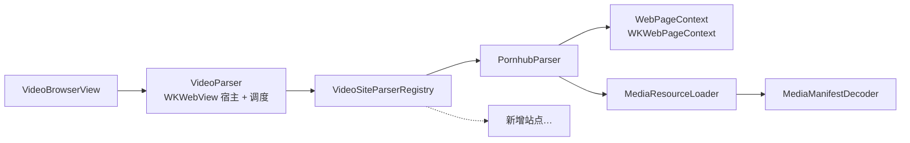

# Nox

一个 iOS 视频下载工具：内置浏览器打开视频页面，解析出可下载的清晰度，然后分片下载到本机，可通过「文件」App 访问。

- 版本：见仓库根目录 `VERSION`
- Bundle ID：`com.aholic.nox`
- 最低系统：iOS 17.0（仅 iPhone）
- 支持语言：简体中文、English、한국어、Français、Deutsch

---

## 功能

### 浏览

- 内置 `WKWebView`，顶部为胶囊形地址栏；页面向下滚动时地址栏自动收缩，回到顶部展开
- 地址栏支持一键清空；键盘「前往」即加载并收起键盘（无独立「打开」按钮）
- 「解析视频」与 Sniffer 入口都是右下角的液态玻璃悬浮胶囊，点击弹出半屏面板；两者互斥：当前页面能被具名站点解析时只显示「解析视频」，否则只显示 Sniffer（仍受「解析来源」里的开关控制），任何页面都不会同时冒出两个入口
- 后退 / 前进使用系统边缘滑动手势，刷新使用下拉刷新（无独立按钮）
- 打开无效或被拒绝访问的地址时会弹出「无法打开该网页」提示（`WKWebView` 会停留在上一个页面，仅靠页面本身看不出加载失败）
- 打开过的视频页面会记入历史（最多保留 50 条）

### 解析（可扩展的站点插件）

- 解析规则按站点实现，通过注册表按 URL 匹配，`VideoBrowserView` 等调用方无需改动
- 当前内置：Pornhub / Pornhub Premium
- 每个站点在「设置 → 解析来源」里有独立开关；关闭后该站点的页面无法解析，解析入口不再出现
- 通用兜底解析器在界面里直接显示为 Sniffer
- 解析成功后可选清晰度，或按「设置 → 下载设置 → 下载清晰度」的偏好自动选择（每次询问 / 最佳 / 1080 / 720 / 480 / 360）

### 下载

- **断点续传**：先用 `Range: bytes=0-0` 探测服务器是否支持分段。支持则按字节分片下载，分片写在磁盘上，取消或失败后重试从断点继续；不支持则退化为单流整文件下载
- **多线程下载**（实验性）：可在 1–32 之间选择线程数（默认 4）
- **同时下载任务数**：1 / 3 / 5 / 10 / 20 / 无限制（默认 3）；m3u8 分片并发上限同样为 32
- 合并：分片按序拼接后写入 `Documents/`，随即清理分片与暂存目录
- 列表内实时显示「已下载 / 总大小 · 速度」；失败显示原因；取消显示「已暂停 · 已下载 X，重试可继续」；回到前台会重算速度，不会沿用后台期间的错误采样
- 每条记录标题只占一行（超出用省略号），长按菜单顶部展示完整标题
- 双指下滑进入多选；只有从列表行上开始才触发，空白区域滑动不会进入选择模式；多选态右上角「删除」为红色文字
- 非多选态单击列表行不再留下选中高亮（该状态没有任何对应操作，只会在多选态下响应）
- 长按已完成条目可分享（系统分享面板），左滑删除单条，「清空」会同时删除记录、本地成品文件与未完成分片
- 历史页与下载页一致：左滑删除单条记录，长按菜单顶部展示完整标题

### 设置

- 顶部展示 App 图标与名称（随列表滚动）
- 单行设置项合并到同一个分组里，不再逐条套一层分组卡片
- 下载设置（二级页）：同时下载任务数、下载清晰度、多线程下载 / 下载线程数 / m3u8 分片并发
- 解析来源（二级页）：各站点与 Sniffer 的开关
- 储存空间（二级页）：按「已下载视频 / 下载分片 / 临时文件 / 网络缓存 / 网站数据」分类列出各自占用，可勾选任意几类一起清理；右上角有刷新按钮可重新统计
- 语言、版本（形如 `v1.0.10`）

### 文件访问

`Info.plist` 已开启 `UIFileSharingEnabled` 与 `LSSupportsOpeningDocumentsInPlace`，下载完成的视频可在「文件」App → 我的 iPhone → Nox 下直接查看、播放、导出。

---

## 目录结构

```
.
├── Info.plist                      # 真实生效的 Info.plist（GENERATE_INFOPLIST_FILE = NO）
├── VERSION                         # 版本号，CI 据此打 tag
├── .github/workflows/
│   └── build-and-release.yml       # 合并到 main 后构建无签名 IPA 并发 Release
├── Nox/
│   ├── NoxApp.swift                # @main，注入语言环境
│   ├── ContentView.swift           # TabView：浏览 / 下载 / 历史 / 设置
│   ├── Models.swift                # 领域模型、错误、传输统计
│   ├── AppState.swift              # 全局状态与持久化；AppLocale / L(_:) / 语言管理
│   ├── VideoParser.swift           # WKWebView 宿主 + 解析调度
│   ├── Parsers/
│   │   ├── VideoSiteParser.swift           # 协议、页面上下文、通用请求与清单解析
│   │   ├── VideoSiteParserRegistry.swift   # 站点注册表
│   │   └── PornhubParser.swift             # Pornhub 解析实现
│   ├── DownloadManager.swift       # 分片下载、续传、合并、进度统计
│   ├── VideoBrowserView.swift      # 浏览页
│   ├── DownloadsView.swift         # 下载页
│   ├── HistoryView.swift           # 历史页
│   ├── SettingsView.swift          # 设置页 + 下载设置 / 解析来源 / 储存空间二级页
│   ├── Localizable.xcstrings       # 字符串目录（5 种语言）
│   └── Assets.xcassets/            # AppIcon 与设置页用的 AppIconPreview
└── Nox.xcodeproj/                  # 手写工程文件
```

---

## 构建

### 本地（Xcode）

1. 用 Xcode 26 打开 `Nox.xcodeproj`
2. 选择 `Nox` scheme 与目标设备
3. 首次运行需在 Signing & Capabilities 里填入自己的 `DEVELOPMENT_TEAM`（仓库中为空）

### 本地 / CI（命令行，无签名）

```bash
xcodebuild \
  -project Nox.xcodeproj \
  -scheme Nox \
  -sdk iphoneos \
  -configuration Release \
  -destination 'generic/platform=iOS' \
  -derivedDataPath build/DerivedData \
  MARKETING_VERSION=0.0.0 \
  CURRENT_PROJECT_VERSION=1 \
  CODE_SIGNING_ALLOWED=NO \
  CODE_SIGNING_REQUIRED=NO \
  build
```

产物位于 `build/DerivedData/Build/Products/Release-iphoneos/Nox.app`。

自定义校验（可选，能提前暴露资源与工程配置问题）：

```bash
plutil -lint Info.plist

APP=build/DerivedData/Build/Products/Release-iphoneos/Nox.app
ls "$APP" | grep lproj   # 期望 5 个：de en fr ko zh-Hans
plutil -p "$APP/Info.plist" | grep -E "CFBundleDisplayName|CFBundleIdentifier"
```

### 发布流程

`.github/workflows/build-and-release.yml` 在 **PR 合并进 `main`** 时触发：

1. 校验 `Info.plist`（`plutil -lint`，并断言 `UIFileSharingEnabled` / `LSSupportsOpeningDocumentsInPlace` 为布尔 `true`）
2. 读取 `VERSION`，校验 semver，生成 tag `v<VERSION>`
3. 若该 tag 已存在则整体跳过（**不会重复发布**）
4. 以 `VERSION` 作为 `MARKETING_VERSION`、以 run number 作为 `CURRENT_PROJECT_VERSION` 构建无签名 App
5. 打包为 `Nox-<VERSION>-unsigned.ipa`，计算 SHA256
6. 用 PR 描述 + SHA256 作为正文创建 GitHub Release

因此：**每次发版前必须 bump `VERSION`**，否则 tag 已存在会被跳过。

> 无签名 IPA 需自行签名（AltStore / SideStore / TrollStore / 开发者证书重签等）后才能安装。

---

## 架构要点

### 站点解析是可插拔的



`VideoSiteParser` 定义单个站点的规则，`WebPageContext` 把 `WKWebView` 隔离在协议之后，`MediaResourceLoader` / `MediaManifestDecoder` 提供多数站点通用的"带 Referer/Cookie 请求清单 → 解析清晰度"流程。

**新增一个站点：**

1. 在 `Nox/Parsers/` 新建 `XxxParser.swift`：

```swift
import Foundation

@MainActor
final class XxxParser: VideoSiteParser {
    // 稳定标识，用于持久化开关状态；一经发布不要再改
    let identifier = "xxx"
    let displayName = "XXX"

    func canHandle(_ url: URL) -> Bool {
        guard url.scheme == "https", let host = url.host else { return false }
        return host == "xxx.com" || host.hasSuffix(".xxx.com")
    }

    func parse(page: WebPageContext) async throws -> [VideoVariant] {
        // 1) page.evaluate(js) 从页面取数据
        // 2) 需要额外请求用 MediaResourceLoader.fetch(...)
        // 3) 结构是 [{ videoUrl, quality, format }] 时用 MediaManifestDecoder.variants(from:)
        // 4) 都不符合时抛 ParserError 中最贴近的 case
        throw ParserError.noMediaDefinitions
    }
}
```

2. 在 `VideoSiteParserRegistry.swift` 的 `all` 里追加 `XxxParser(),`
3. 把新文件加入 `Nox.xcodeproj` 的 `Nox` 组与 target（Xcode 里拖入勾选 target 即可；本项目是手写 pbxproj，不会自动同步目录）

设置页的站点开关会自动出现，`VideoParser`、各视图无需改动。

### 分片下载

- 分片边界是 `(总大小, 分片数)` 的纯函数结果，只要这两个值不变，重启后算出的边界必然一致 → 可以安全续传
- 分片与暂存位于 `Application Support/Nox/`（用户不可见，也不会被系统当作缓存清理）；成品在 `Documents/`
- 数据库（`UserDefaults`）中**只存文件名**，不存绝对路径 —— 沙盒容器路径会随重装/更新变化
- 高频进度回调只改内存（`updateDownload(_:persist: false)`），不每次写 `UserDefaults`

---

## 本地化

文案集中在 `Nox/Localizable.xcstrings`（字符串目录），`sourceLanguage` 为 `zh-Hans`。

代码里**必须**用显式查表函数 `L(_:)`，不能用字面量：

```swift
// ✅ 会按 App 内选择的语言查表
Text(L("设置"))
Button(L("清空")) { … }
Label(L("解析视频"), systemImage: "arrow.down.circle")
.navigationTitle(L("下载"))

// ✅ 带插值
String(format: L("页面加载失败：%@"), message)

// ❌ 这些走 Bundle.main（系统语言），App 内切换语言不会生效
Text("设置")
String(localized: "设置")
String(localized: "页面加载失败：\(message)")
```

**任何使用 `L(...)` 的视图都需要观察语言变化**，否则切换语言后界面不会重算：

```swift
@ObservedObject private var localization = LocalizationManager.shared
```

**新增文案**：手写加入 `Localizable.xcstrings` 的对应语言列。因为 `L(_:)` 的参数是变量，Xcode 无法自动提取，不会像 `Text("字面量")` 那样自动出现在待翻译列表里。

### 新增语言

1. `Localizable.xcstrings` 里为每个键补该语言的 `localizations` 条目
2. `AppState.swift` 的 `AppLanguage` 增加 case（`rawValue` 必须等于 `.lproj` 目录名）
3. `Info.plist` 的 `CFBundleLocalizations` 加入该语言代码
4. `project.pbxproj` 的 `knownRegions` 加入该语言代码

App 内可切换语言或选择「跟随系统」；系统语言不在支持列表时回落到 `CFBundleDevelopmentRegion`。

---

## 已知限制

- **后台会话缺少 `AppDelegate` 回调**：`URLSessionConfiguration.background` + `sessionSendsLaunchEvents = true` 需要在系统唤醒 App 时处理 `application(_:handleEventsForBackgroundURLSession:completionHandler:)`，当前未实现，`urlSessionDidFinishEvents(forBackgroundURLSession:)` 为空。App 被挂起后下载可能暂停，重试即可续传
- **服务器不支持 `Range` 时无法续传**，且总大小未知，进度只显示已下载量与速度
- **`PRODUCT_BUNDLE_IDENTIFIER` 一旦对外发布不要修改**，否则等同换一个 App，沙盒数据（下载记录、设置、Documents 内的视频）不会继承
- 下载能力由站点解析结果决定，本仓库仅包含站点适配逻辑，不提供任何内容